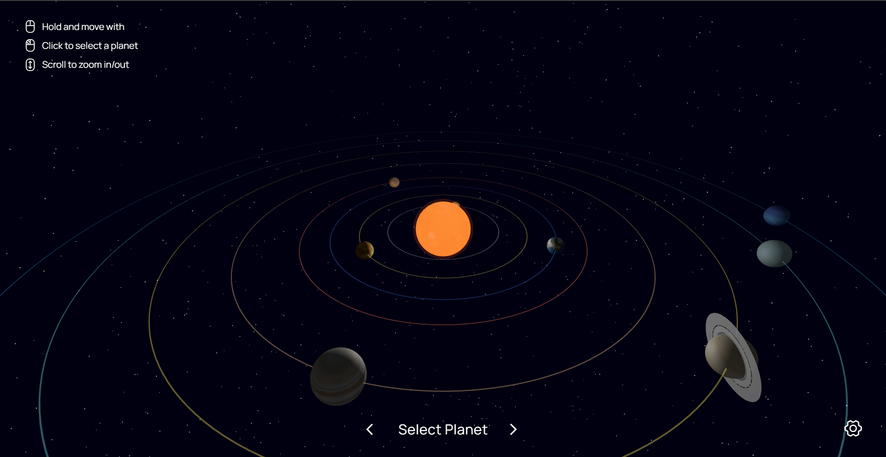

# 3D Solar System

An interactive 3D simulation of our solar system built with React, Three.js, and React Three Fiber.



## Features

-   **Interactive 3D Solar System**: Explore a realistic model of our solar system with all eight planets
-   **Planet Selection**: Click on any planet to select it and view details
-   **Camera Tracking**: Camera automatically tracks selected planets as they orbit
-   **Planet Customization**: Adjust size, orbit radius, and speed of each planet
-   **Realistic Visuals**: High-quality textures and lighting effects for planets and the sun
-   **Saturn Rings**: Detailed rendering of Saturn's iconic ring system
-   **Configuration Management**: Save and load different solar system configurations using Firebase
-   **Responsive Controls**: Intuitive mouse controls for camera movement and zoom

## Technologies Used

-   **React** - UI framework
-   **Three.js** - 3D rendering library
-   **React Three Fiber** - React renderer for Three.js
-   **React Three Drei** - Useful helpers for React Three Fiber
-   **Firebase** - For storing and retrieving solar system configurations
-   **TailwindCSS** - For styling UI components

## Controls

-   **Mouse Drag**: Rotate the camera view
-   **Mouse Scroll**: Zoom in and out
-   **Click**: Select a planet
-   **Navigation Arrows**: Move between planets
-   **Settings Gear**: Access configuration options

## Setup and Installation

1. Clone the repository
2. Install dependencies:
    ```
    npm install
    ```
3. Start the development server:
    ```
    npm run dev
    ```
4. Open your browser and navigate to the local development server (typically http://localhost:5173)

## Planet Customization

Each planet can be customized with the following parameters:

-   **Size**: Adjust the relative size of the planet
-   **Speed**: Change the orbital velocity
-   **Orbit Radius**: Modify the distance from the sun

## Firebase Integration

The application uses Firebase to:

-   Save custom solar system configurations
-   Load previously saved configurations

## Credits

-   Planet textures sourced from NASA public domain images
-   Built as part of a college semester project (SEM 6)

## License

MIT License
